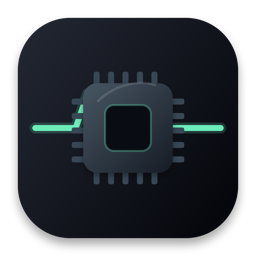
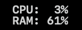
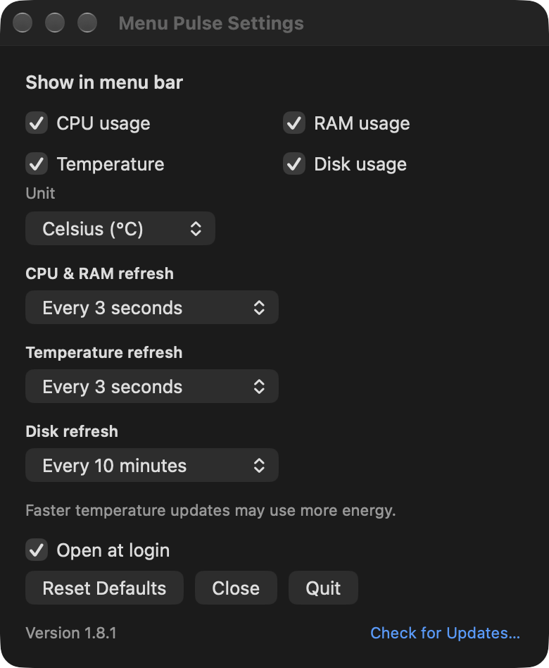

# Menu Pulse

<p align="center">
  
</p>

[English README](README.md)

CPU와 RAM 사용량을 Mac 메뉴바에서 한눈에 확인하는 작은 앱입니다. 온도와 디스크 사용량은 필요할 때 켤 수 있습니다.

<p align="center">
  
</p>

## 다운로드

**[최신 DMG 다운로드](https://github.com/hyunseop827/menu-pulse/releases/latest/download/MenuPulse.dmg)** · 무료 · Apple Silicon · macOS 13 이상

DMG를 열고 **Menu Pulse**를 **Applications**(응용 프로그램) 폴더로 드래그합니다. 앱을 사용하기 위해 이 저장소를 내려받거나 보관할 필요는 없습니다.

**앱은 ad-hoc 서명을 사용하며 Apple 공증을 받지 않았습니다.** 처음 실행할 때 macOS가 차단하면 실행을 시도한 뒤 **시스템 설정 → 개인정보 보호 및 보안 → 그래도 열기**를 선택하세요. [Apple 안내](https://support.apple.com/ko-kr/guide/mac-help/mh40616/mac)를 참고할 수 있습니다.

버전별 변경 내용은 [릴리스 노트](https://github.com/hyunseop827/menu-pulse/releases)에서 확인하세요.

<details>
<summary>다운로드 체크섬 검증</summary>

```zsh
curl -LO https://github.com/hyunseop827/menu-pulse/releases/latest/download/MenuPulse.dmg
curl -LO https://github.com/hyunseop827/menu-pulse/releases/latest/download/SHA256SUMS.txt
shasum -a 256 -c --ignore-missing SHA256SUMS.txt
```

</details>

### 업데이트

- 설정창에서 **Check for Updates…**를 누르면 바로 확인합니다. 실행 중에는 하루 한 번 스스로도 확인합니다.
- 새 버전이 있으면 바뀐 점을 보여 주고 묻습니다. **Install Update**를 선택할 때만 새 버전을 내려받아 서명을 확인한 뒤 앱을 교체하고 다시 엽니다. 묻지 않고 설치하는 일은 없습니다.
- 앱은 응용 프로그램 폴더에 두세요. DMG 안에서 연 앱은 스스로 업데이트할 수 없습니다.
- **1.7.0을 쓰고 있다면** 1.7.0의 **Check for Updates…**로 이 버전을 설치할 수 있습니다. 1.7.0 이전 버전에는 업데이트 기능이 없으니 한 번은 새 DMG의 앱으로 교체하세요.

## 기능

| 지표 | 기본 상태 | 갱신 주기 |
| --- | --- | --- |
| CPU | ON | 1초, 3초, 10초 — 기본 3초 |
| RAM | ON | CPU 주기 공유 |
| TEMP | OFF | 1초, 3초, 10초, 30초, 60초 — 기본 30초 |
| DISK | OFF | 1분, 3분, 5분, 10분 — 기본 5분 |

지표를 한두 개 켜면 한 줄에 하나씩 표시합니다. 세 개 이상이면 CPU·RAM은 왼쪽, TEMP·DISK는 오른쪽 열에 표시합니다.

<p align="center">
  
</p>

TEMP는 섭씨와 화씨를 지원하며 앱에서 읽을 수 있는 부품 센서 중 가장 높은 온도를 표시합니다. 배터리와 보정용 센서는 제외합니다. Mac 기종과 macOS 버전에 따라 센서를 읽지 못할 수 있으며, 실패하면 `--`를 표시하고 5분마다 재시도합니다. DISK는 홈 볼륨 사용량을 표시하며, Finder와 같이 시스템이 비울 수 있는 공간도 사용 가능한 공간으로 계산합니다. 남은 디스크 공간과 TEMP 상태 같은 자세한 내용은 메뉴바 항목에 마우스를 올리면 확인할 수 있습니다.

메뉴바 항목을 클릭하면 설정창이 열리며, 설치된 버전과 **Check for Updates…** 버튼이 있습니다. 카메라 노치 등에 가려 메뉴바 항목이 보이지 않으면 응용 프로그램 폴더에서 Menu Pulse를 다시 실행하면 설정창이 열립니다. 설정창은 **⌘W** 또는 **Esc**로 닫을 수 있고, 다시 열면 마지막 위치에 표시됩니다. 처음 실행하면 **Open at login**(로그인 시 열기)을 켤지 한 번 묻고, 이후 설정에서 변경할 수 있습니다. **Reset Defaults는 지표 설정을 기본값으로 되돌리고 Open at login을 켭니다.** Reset Defaults와 Quit은 확인창을 표시하며, 종료해도 로그인 설정은 유지됩니다.

<details>
<summary>설정 화면 보기</summary>

<p align="center">
  
</p>

</details>

## 자원 사용과 개인정보

- Objective-C/AppKit 네이티브 앱; Electron, 웹뷰, 그래프, Dock 아이콘 없음
- 타이머 하나로 활성화한 지표만 조회하며 화면이 꺼져 있거나 다른 사용자 세션이 활성화된 동안 정기 조회 중단
- 계정과 사용 추적 없음. 오류 보고 SDK, 기록, 지표 로그도 없음
- 인터넷은 업데이트 확인에만 씀. 실행 중 하루 한 번, 그리고 **Check for Updates…**를 누를 때 GitHub에서 최신 릴리스의 업데이트 목록(`appcast.xml`)을 읽으며, Mac이나 측정값에 관한 정보는 보내지 않음
- 새 버전은 설치를 선택할 때만 GitHub에서 내려받으며, 열기 전에 앱 안의 서명 키(EdDSA)로 확인함. 업데이트는 [Sparkle](https://sparkle-project.org)이 처리함
- 표시 설정, 갱신 주기, 온도 단위, 설정창과 메뉴바 항목 위치, 로그인 질문 완료 여부만 저장. Sparkle은 앱 설정에 약간의 상태(마지막 확인 시각, 건너뛴 버전, 창 위치)를 저장함

자원 사용량은 Mac 기종, macOS 버전, 활성화한 지표와 갱신 주기에 따라 달라집니다. TEMP 1초 설정은 센서 조회가 가장 많으므로 짧게 확인할 때 사용하는 것이 좋습니다. 특정 체크아웃의 측정 조건과 결과를 남기려면 [벤치마크](#벤치마크)를 참고하세요.

## 삭제

설정창에서 **Open at login**을 끄고 **Quit**을 누른 뒤, `/Applications/Menu Pulse.app`을 휴지통으로 옮깁니다. 저장된 설정까지 지우려면 종료한 뒤 `defaults delete dev.hyunseop.MenuPulse`를 실행합니다.

## 개발

```sh
make app      # build/release에 앱 빌드
make check    # 문법·메타데이터·정적 분석·테스트·앱 검증
make dmg      # dist에 DMG, ZIP, SHA256SUMS.txt 생성
```

Xcode Command Line Tools가 필요합니다. 처음 빌드할 때 Sparkle 2.10.0을 GitHub 릴리스에서 내려받아 고정된 SHA-256과 비교한 뒤 `build/sparkle`에 보관합니다. 빌드·테스트는 앱 설치나 로그인 항목 등록을 하지 않습니다. 테스트 실행 파일은 임시 폴더에서 실행한 뒤 정리합니다.

## 벤치마크

Xcode Command Line Tools가 필요합니다. 현재 체크아웃을 별도 앱 식별자로 빌드해 측정하며, 다운로드한 릴리스 DMG를 직접 측정하지는 않습니다.

```sh
# 기본값: CPU + RAM 3초마다; 준비 30초 + 측정 5분
Scripts/benchmark.sh

# 모든 지표를 최단 주기로 조회
ALL_METRICS=1 CPU_RAM_REFRESH_INTERVAL=1 TEMPERATURE_REFRESH_INTERVAL=1 \
  DISK_REFRESH_INTERVAL=60 Scripts/benchmark.sh
```

화면을 켠 상태에서 측정하세요. 실행할 때마다 새 `build/benchmarks/run-…/` 폴더에 측정 조건과 원자료를 저장합니다.

- `report.txt`: 빌드·기기·측정 조건과 결과 요약
- `samples.txt`: `ps`로 수집한 CPU·RSS 표본
- `vmmap.txt`: 마지막 `vmmap` 출력, 조회하지 못했다면 그 이유
- `app.log`: 측정한 앱의 출력

`SHOW_CPU`, `SHOW_RAM`, `SHOW_TEMPERATURE`, `SHOW_DISK`(0 또는 1)로 지표를 하나씩 고를 수 있고, `INTERVAL`로 표본 간격(초, 기본 1)을 정할 수 있습니다. 저장할 상위 폴더는 `RESULTS_DIR`로 바꿀 수 있습니다. 스크립트가 실행되는지만 짧게 확인하려면 `WARMUP=0 DURATION=10 Scripts/benchmark.sh`를 사용하고, 비교할 때는 충분한 시간 동안 반복 측정하세요.

CPU 결과는 `ps` 값을 요약한 것입니다. 이 값은 최대 1분의 감쇠 평균이며, 서로 독립적인 1초 구간 측정값은 아닙니다. RSS와 Private dirty는 서로 다른 메모리 지표로 MiB 단위로 구분해 표시하며, Private dirty는 총 메모리 사용량이 아닙니다. 같은 기기·macOS·활성 지표·갱신 주기에서 얻은 결과끼리 비교하세요.

종료 시 임시 빌드·임시 홈 폴더와 측정 프로세스는 정리하고 결과는 보존합니다. 측정용 빌드는 별도 번들 식별자를 쓰므로 설치된 앱의 설정과 로그인 등록을 공유하지 않습니다.

## AI를 활용한 개발

Menu Pulse는 Hyunseop Kim이 무엇을 만들고 언제 내보낼지 정하고, Claude Code를 비롯한 AI 코딩 에이전트가 그 지시에 따라 개발합니다. 에이전트는 [`AGENTS.md`](AGENTS.md)(영문)에 정리된 프로젝트 규칙을 따릅니다. 변경을 만들고 검증하는 방식은 [AI를 활용한 개발](docs/AI_DEVELOPMENT.ko.md)에, 앱의 동작 방식은 [Architecture](docs/ARCHITECTURE.md)(영문)에 정리되어 있습니다.

## 라이선스

[MIT](LICENSE) — 자유롭게 사용, 수정, 배포할 수 있으며 별도 보증은 제공하지 않습니다.

업데이트에는 [Sparkle](https://github.com/sparkle-project/Sparkle)(MIT)을 사용하며, 그 라이선스는 앱 안의 `ThirdPartyNotices.txt`에 들어 있습니다.
