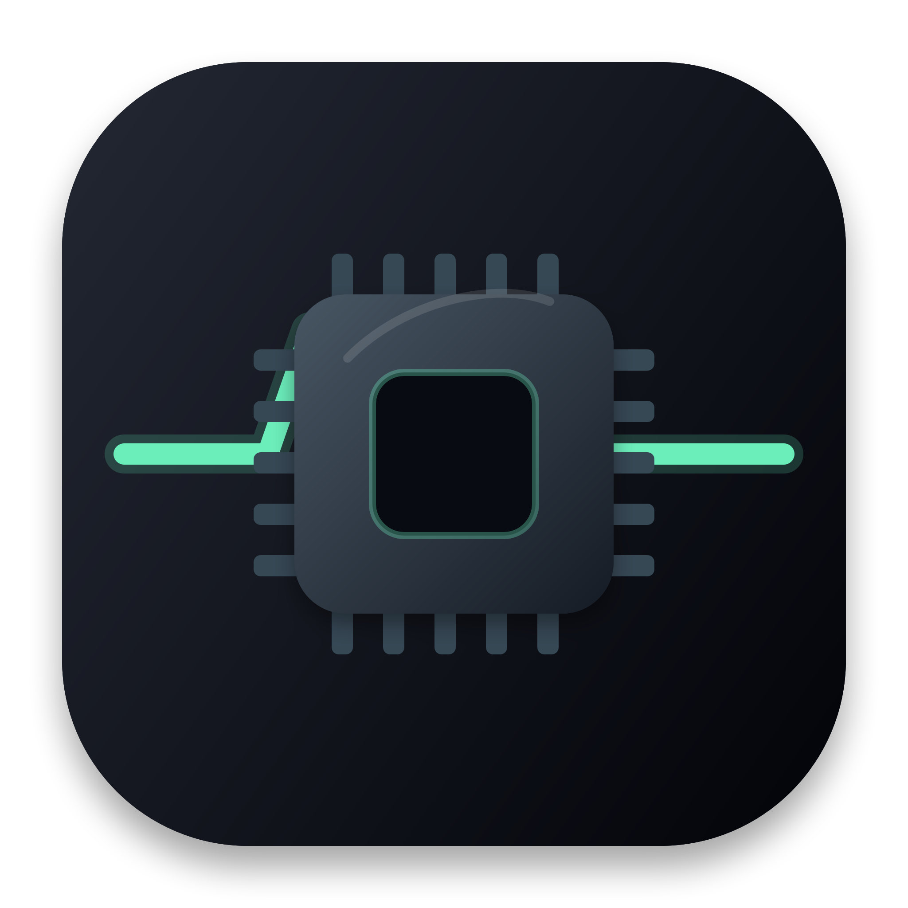
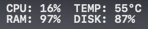
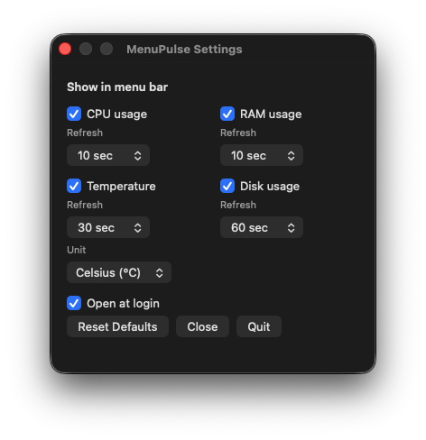

# Menu Pulse

<p align="center">
  
</p>

[한국어 README](README.ko.md)

This is not a full monitoring dashboard. It is a small menu bar app for checking only the numbers you actually need.

By default it shows `CPU` and `RAM`. You can also enable `TEMP` and `DISK` if you want.

```text
CPU: 12%    TEMP: 52°C
RAM: 63%    DISK: 87%
```

Menu Pulse is built for **Apple Silicon Macs**, with **core metrics** and **low resource usage** as the main idea.

<table>
  <tr>
    <td align="center" width="50%">
      <strong>2-row menu bar layout</strong><br><br>
      
    </td>
    <td align="center" width="50%">
      <strong>Simple Settings</strong><br><br>
      
    </td>
  </tr>
</table>

## Download

[Download latest DMG](https://github.com/hyunseop827/menu-pulse/releases/latest/download/MenuPulse.dmg)

This app is not notarized by Apple yet, so macOS may show a warning on first launch.

If macOS blocks it, run:

```zsh
sudo xattr -dr com.apple.quarantine "/Applications/Menu Pulse.app"
open "/Applications/Menu Pulse.app"
```

## License

MIT License.

You can use, modify, and distribute it freely. The app is provided as-is, without warranty.

See [LICENSE](LICENSE) for details.

## Features

- `CPU`: on by default
- `RAM`: on by default
- `TEMP`: optional, off by default, Celsius/Fahrenheit
- `DISK`: optional, off by default

RAM is calculated close to Activity Monitor's `Memory Used`: app memory + wired memory + compressed memory.

Temperature uses IOHID first, then falls back to SMC. It can work on many Apple Silicon Macs, but it is not guaranteed on every macOS/device combination.

If temperature cannot be read, it is shown like `TEMP:--°C`.

Default refresh intervals:

```text
CPU  10s
RAM  10s
TEMP 30s
DISK 300s
```

Each metric can have its own refresh interval in Settings.

## Low Resource Intent

Menu Pulse is not trying to be a feature-heavy monitoring app. It is for checking small menu bar numbers with as little overhead as possible.

- Native Objective-C/AppKit app
- No Electron, web view, or charts
- No history storage or dashboard
- No Dock icon while running
- Only reads the metrics you enable
- Does not read temperature sensors when `TEMP` is off
- Uses one lightweight timer to refresh only what is due

If you want to benchmark it yourself:

```sh
Scripts/measure.sh
```

## Development

### Project Structure

```text
Sources/MenuPulse/
  main.m
  MenuPulse.m
  Monitors.m
  TemperatureReader.m
  LoginItemManager.m

Packaging/
  Info.plist
  AppIcon.icns

Scripts/
  build-app.sh
  build-dmg.sh
  install.sh
  uninstall.sh
  measure.sh
  release.sh
```

### Scripts

| Script | Use it for |
| --- | --- |
| `Scripts/build-app.sh` | Builds the Objective-C source into `build/release/Menu Pulse.app`. Use it for local development checks. |
| `Scripts/build-dmg.sh` | Rebuilds the app and creates `dist/MenuPulse.dmg`. Use it to check the distributable file. |
| `Scripts/install.sh` | Installs the app to `~/Applications` and sets it to open automatically when you log in. |
| `Scripts/uninstall.sh` | Removes the installed app and the login auto-start setting. |
| `Scripts/measure.sh` | Runs the app briefly and measures CPU, memory usage, app size, and DMG size. |
| `Scripts/release.sh` | Takes a version, updates `Info.plist`, builds the DMG, commits, tags, and pushes. |
