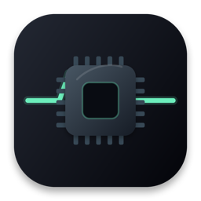
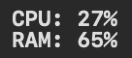
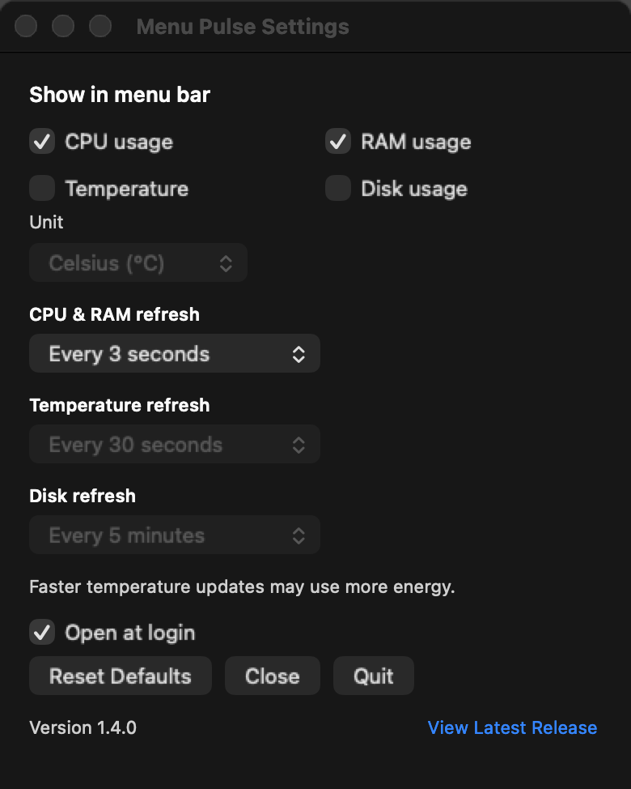

# Menu Pulse

<p align="center">
  
</p>

[한국어 README](README.ko.md)

This is not a full monitoring dashboard. It is a small menu bar app for checking only the numbers you actually need.

By default it shows `CPU` and `RAM`. You can also enable `TEMP` (temperature) and `DISK`.

```text
CPU: 12%    TEMP: 52°C
RAM: 63%    DISK: 87%
```

Menu Pulse is built for **Apple Silicon Macs running macOS 13 or later**, with **core metrics** and **low resource usage** as the main idea.

## Screenshots

<p align="center">
  
</p>
<p align="center"><sub>Menu bar monitoring</sub></p>

<p align="center">
  
</p>
<p align="center"><sub>Simple metric and login settings</sub></p>

## Download

[Download latest DMG](https://github.com/hyunseop827/menu-pulse/releases/latest/download/MenuPulse.dmg)

Download the DMG and checksum file into the same directory, then verify the release:

```zsh
curl -LO https://github.com/hyunseop827/menu-pulse/releases/latest/download/MenuPulse.dmg
curl -LO https://github.com/hyunseop827/menu-pulse/releases/latest/download/SHA256SUMS.txt
shasum -a 256 -c SHA256SUMS.txt
```

`MenuPulse.dmg: OK` means the downloaded file matches the published checksum.

This app is not notarized by Apple yet, so macOS may show a warning on first launch.
Move the app to `/Applications`, then right-click it in Finder and choose `Open`.
If macOS still blocks it and checksum verification succeeded, you can run:

```zsh
sudo xattr -dr com.apple.quarantine "/Applications/Menu Pulse.app"
open "/Applications/Menu Pulse.app"
```

## License

MIT License.

You can use, modify, and distribute it freely. The app is provided as-is, without warranty.

See [LICENSE](LICENSE) for details.

## Features

- `CPU`: on by default
- `RAM`: on by default
- `TEMP`: optional, off by default, Celsius/Fahrenheit
- `DISK`: optional, off by default

RAM is calculated close to Activity Monitor's `Memory Used`: app memory + wired memory + compressed memory.

Each temperature refresh compares every available IOHID sensor. If IOHID fails, it compares every supported SMC key.
The hottest valid reading is shown as `TEMP`. It is not guaranteed on every device combination.
If no temperature can be read, it is shown as `TEMP:--°C`.

Default refresh intervals:

```text
CPU  10s
RAM  10s
TEMP 30s
DISK 300s
```

Refresh intervals are fixed to keep behavior simple and lightweight.

## Low Resource Intent

Menu Pulse is not trying to be a feature-heavy monitoring app. It is for checking small menu bar numbers with as little overhead as possible.

- Native Objective-C/AppKit app
- No Electron, web view, or charts
- No history storage or dashboard
- No Dock icon while running
- Only reads the metrics you enable
- Does not read temperature sensors when `TEMP` is off
- Uses one lightweight timer to refresh only what is due
- Uses the native macOS login item API

### Measured Benchmark

Measured with Menu Pulse `1.1.1` on July 28, 2026.

- MacBook Air with an 8-core Apple M1
- 16GB memory and 256GB SSD
- macOS 26.5.2
- 30-second warm-up after launch
- 20 samples over 60 seconds at 3-second intervals

| Enabled metrics | CPU average | CPU maximum | RSS average | RSS maximum | Private dirty |
| --- | ---: | ---: | ---: | ---: | ---: |
| CPU + RAM (default) | 0.060% | 1.200% | 39.6MB | 39.7MB | 9.9MB |
| CPU + RAM + TEMP + DISK | 0.140% | 1.600% | 38.0MB | 38.1MB | 10.4MB |

- Installed app size: approximately 624KB
- Release DMG size: approximately 960KB

RSS includes shared system frameworks used by the app.
For example, the default configuration reported 39.6MB RSS, while private dirty memory, which is closer to app-specific changed memory, was 9.9MB.
The CPU maximum is a short burst while metrics refresh.
Results can vary with other running processes and the macOS cache state.

To reproduce the measurement, launch the app, wait 30 seconds, and run:

```sh
DURATION=60 INTERVAL=3 Scripts/measure.sh
```

## Development

### Project Structure

```text
Sources/MenuPulse/
  main.m
  MenuPulse.m
  Monitors.m
  TemperatureReader.m
  LoginItemManager.m

Packaging/
  Info.plist
  AppIcon.icns

Scripts/
  build-app.sh
  build-dmg.sh
  install.sh
  uninstall.sh
  measure.sh
  release.sh

Tests/
  MonitorTests.m
```

### Scripts

| Script | Use it for |
| --- | --- |
| `Scripts/build-app.sh` | Builds the Objective-C source into `build/release/Menu Pulse.app`. Use it for local development checks. |
| `Scripts/build-dmg.sh` | Rebuilds the app and creates `dist/MenuPulse.dmg`. Use it to check the distributable file. |
| `Scripts/install.sh` | Installs the app to `~/Applications` and registers it to open at login. macOS may require approval. |
| `Scripts/uninstall.sh` | Removes the installed app and the login auto-start setting. |
| `Scripts/measure.sh` | Runs the app briefly and measures CPU, memory usage, app size, and DMG size. |
| `Scripts/test.sh` | Checks monitor ranges, CPU reset behavior, and Mach host port reference leaks. |
| `Scripts/release.sh` | Takes a version, updates `Info.plist`, builds the DMG, commits, tags, and pushes. |
